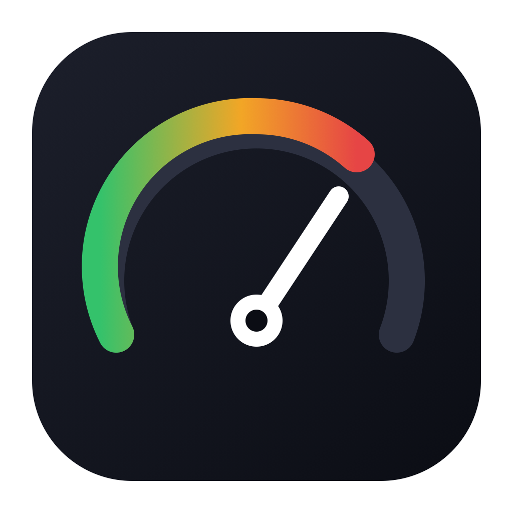
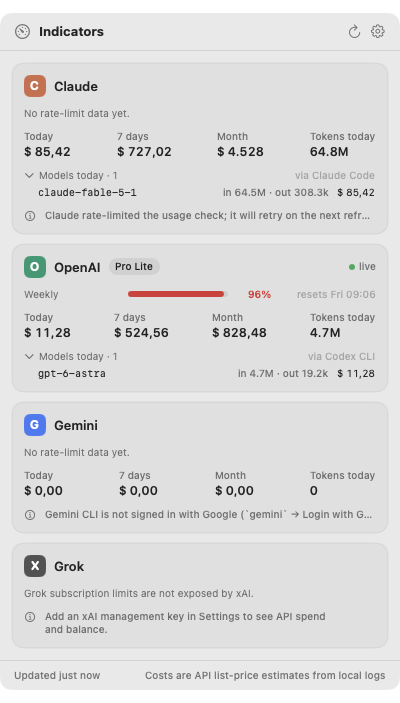
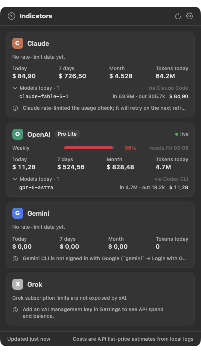

<p align="center">
  
</p>

<h1 align="center">Indicators</h1>

<p align="center">
  AI usage and cost, in your macOS menu bar.<br>
  Subscription limits for <b>Claude</b>, <b>OpenAI</b> and <b>Gemini</b>, plus <a href="https://github.com/ryoppippi/ccusage">ccusage</a>-style cost estimates and real billed spend.
</p>

<p align="center">
  <a href="https://indicators.jonymusky.com">indicators.jonymusky.com</a> ·
  <a href="https://github.com/jonymusky/indicators/releases/latest">Download</a> ·
  <a href="#build-from-source">Build from source</a>
</p>

<p align="center">
  
</p>

<p align="center">
  
</p>

<p align="center">
  
  &nbsp;&nbsp;
  
</p>

## What it shows

| | Rate-limit windows (%) | Cost estimate from local logs | Real billed spend |
| --- | --- | --- | --- |
| **Claude** | 5-hour session, weekly, per-model weekly, extra usage — from your Claude Code login | `~/.claude/projects` transcripts | Anthropic Admin API (optional key) |
| **OpenAI** | Plan windows from your Codex CLI / ChatGPT login (falls back to the last values Codex wrote to its log) | `~/.codex/sessions` rollouts | OpenAI Costs API (optional admin key) |
| **Gemini** | Per-model quota buckets from your Gemini CLI Google login | `~/.gemini/tmp/*/chats` sessions | — |
| **Grok** | xAI does not expose subscription limits | — | xAI Management API: month-to-date spend and prepaid balance (optional key + team id) |

- **Menu bar**: `Claude 24% 5h · OpenAI 96%` — the window closest to its limit for each provider (configurable: names or initials, session or weekly, optional today's cost).
- **Popover**: every window with its reset time, today / 7-day / month-to-date cost, tokens today, per-model breakdown, and the vendor-billed spend when a key is configured.
- **Cost estimates** are computed exactly like ccusage: tokens from local logs × public API list prices from [LiteLLM's table](https://github.com/BerriAI/litellm/blob/main/model_prices_and_context_window.json) (bundled snapshot, refreshed automatically). Cache writes at the 1-hour TTL rate are priced correctly. If you are on a subscription, this is what the same work *would* have cost via API; if you use API keys, add them under Settings → Billing APIs to see the real invoice.

## Install

### One-liner

```bash
curl -fsSL https://indicators.jonymusky.com/install.sh | sh
```

Downloads the latest release into `/Applications/Indicators.app`, clears the quarantine flag and launches it.

### Download

Grab `Indicators.zip` from the [latest release](https://github.com/jonymusky/indicators/releases/latest), unzip, move `Indicators.app` to `/Applications`, open it.
The app is ad-hoc signed; the first launch needs a right-click → Open (or `xattr -d com.apple.quarantine /Applications/Indicators.app`).

### Build from source

Requires macOS 14+ and the Xcode Command Line Tools (`xcode-select --install`). No full Xcode needed.

```bash
git clone https://github.com/jonymusky/indicators.git
cd indicators
make app        # → build/Indicators.app
make install    # copies it to /Applications
```

`make demo` re-records the README media (needs Pillow and ffmpeg). `make cli` prints the same cost report in the terminal:

```
Claude (Claude Code) — 338 files
  today $65.98 · 7d $707.57 · 30d $7069.19 · month $4508.67
  claude-fable-5-1  $65.98  in 3588  cacheRead 37547381  cacheWrite 2330787  out 198774
OpenAI (Codex CLI) — 746 files
  today $9.92 · 7d $522.94 · 30d $971.59 · month $826.86
```

## Setup

Nothing to configure for the basics: if you use Claude Code, Codex CLI or Gemini CLI, Indicators reads their local logs and reuses their logins to ask each vendor for your limits.

- **Claude**: sign in to Claude Code once (`claude`). Indicators reads the OAuth token from the Keychain item Claude Code creates; macOS will ask you to allow access the first time.
- **OpenAI**: sign in to Codex CLI with ChatGPT (`codex login`). API-key logins have no plan limits.
- **Gemini**: sign in to Gemini CLI with Google (`gemini` → *Login with Google*). API-key logins show costs but no quota buckets.
- **Billing APIs** (optional, Settings → Billing APIs): Anthropic admin key (`sk-ant-admin…`), OpenAI admin key, xAI management key + team id. Keys are stored in your Keychain and only ever sent to the vendor that issued them.

## Privacy

Everything runs locally. No telemetry, no backend, logs are read-only. See [SECURITY.md](SECURITY.md) for the exact files and endpoints.

## Roadmap

- Notifications when a window crosses a threshold
- Sparkline of daily spend
- More sources: Cursor, OpenCode, Antigravity
- Homebrew cask

Contributions welcome — see [CONTRIBUTING.md](CONTRIBUTING.md).

## Acknowledgements

Cost math and log formats follow [ccusage](https://github.com/ryoppippi/ccusage); the vendor usage endpoints were documented by [CodexBar](https://github.com/steipete/CodexBar) and friends. Pricing data by [LiteLLM](https://github.com/BerriAI/litellm).

## License

[MIT](LICENSE)
